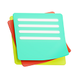

# NoteThat Chrome Extension

Write and save notes on websites with ease.

## Description

NoteThat is a Chrome extension designed to help you take notes on websites for easy reference. With a simple user interface, you can jot down tasks and notes related to specific websites and access them whenever you need. Whether it's jotting down a to-do list, important information, or ideas, NoteThat makes it convenient to manage your tasks.

## NoteThat Extension - Your Personalized Note-Taking Companion

**NoteThat** is now available on GitHub for your personal exploration and usage. Feel free to fork the repository, clone it, and even make your own modifications to suit your preferences. However, if you're looking to unleash the extension's true potential and gain exclusive customization rights, consider acquiring it on BuyMeACoffee.

## Elevate Your Note-Taking Experience

Embrace the full capabilities of **NoteThat** by acquiring it on BuyMeACoffee. By doing so, you not only support ongoing development efforts but also secure the exclusive rights to shape, personalize, and leverage the extension in ways that match your unique needs.

)

Your interest in **NoteThat** and your dedication to its growth are truly appreciated. Let's work together to redefine how you capture, organize, and engage with online information.

Thank you for being a part of the **NoteThat** journey!

## Features

- Add tasks and notes to websites
- Save notes associated with specific websites
- View and manage tasks for the current website
- Download tasks as a text file for offline reference

## Installation

1. Download or clone this repository to your local machine.
2. Open Google Chrome and go to `chrome://extensions/`.
3. Enable "Developer mode" in the top right corner.
4. Click "Load unpacked" and select the folder containing the downloaded extension files.
5. The extension icon should appear in the Chrome toolbar.

## Usage

1. Open a website where you want to add a task or note.
2. Click on the NoteThat extension icon in the Chrome toolbar or use the Ctrl+M shortcut.
3. The extension popup will open, allowing you to input tasks or notes.
4. Click the "Add Task" button to save the task for the current website.
5. Tasks associated with the current website will be listed below.
6. Click the remove icon next to a task to remove it.

## Download Tasks

- Click the "Download Tasks" button to download tasks as a text file named after the current website's domain.

## Credits

- Developed by KHAOUITI ABDELHAKIM ([GitHub Profile](https://github.com/khaouitiabdelhakim))
- Powered by [KHAOUITI Apps](https://khaouitiapps.web.app/)

## Feedback and Contributions

If you have any feedback, suggestions, or issues, please feel free to create an issue or pull request in this repository. Your contributions are welcome and appreciated!

## Contact

For inquiries, you can contact me at [khaouitiapps@gmail.com](mailto:khaouitiapps@gmail.com).

